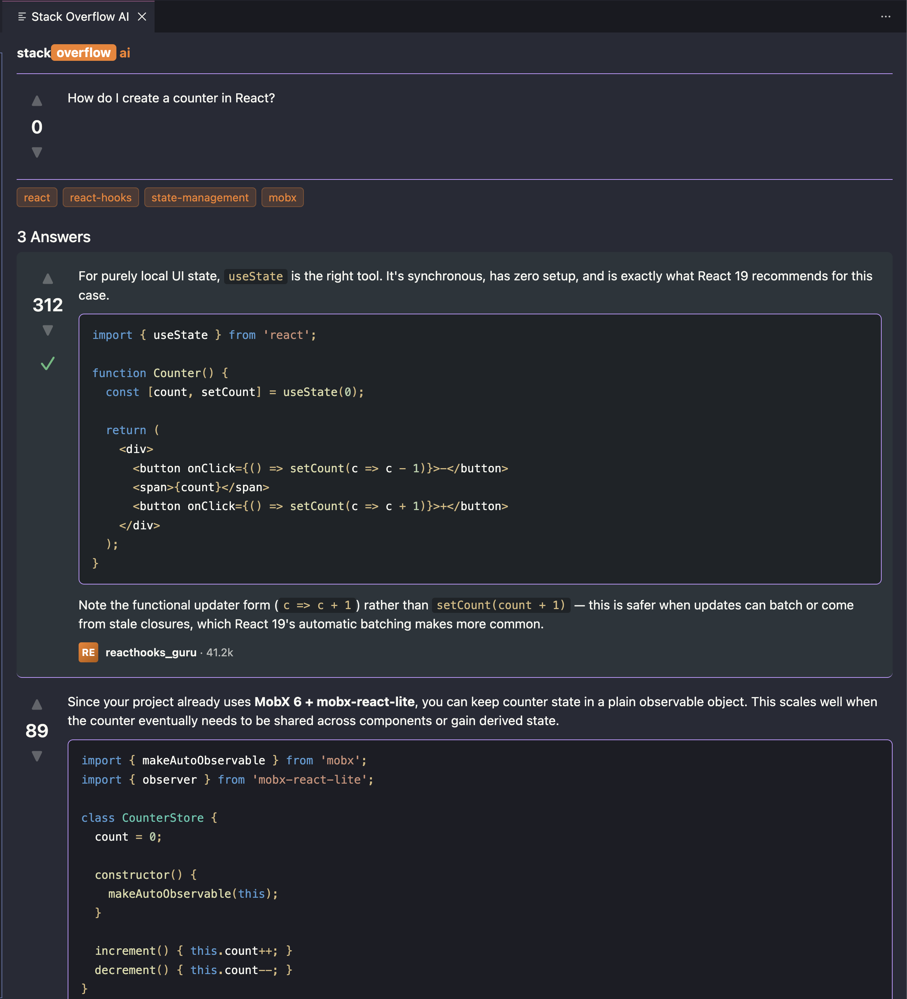

# Stack Overflow AI

A VS Code extension that answers your coding questions in the **format and spirit of a Stack Overflow thread** — terse, multiple competing answers, one accepted — instead of a wall of chatbot prose.

The idea: the SO format is a forcing function for brevity. Make the AI *perform* that format and you get the discipline for free. Multiple answers restore the judgment step you lose with a single confident reply.

<p align="center">
  
</p>

## A statement

This is not an extension trying to solve anything. It is more of a piece of art — the only way I can express my discomfort with what is happening to our craft.

We are all feeling the pressure of generating code with AI for short-sighted productivity gains. And with that, the increase of cognitive debt, constant context switching, and verbose plans nobody really reads. It creates a world with less human collaboration, less joy of crafting, and fewer supporting communities.

We used to have a rhythm of moving between our crafted code and a community that helped us move forward. Waiting for AI-generated code while doom-scrolling AI-generated TikTok is as dark as it gets — but it has very much become a reality.

## How it works

1. Put your cursor (or select code) where you're stuck and run **Stack Overflow AI: Ask about selection** (`cmd+alt+a` / `ctrl+alt+a`, or right-click).
2. Type your question.
3. A side panel opens, styled like a Stack Overflow thread. A live research log shows the agent reading your files, grepping types, and searching the web.
4. You get a thread: the question, then several competing answers with vote counts and one accepted ✓. Hover any code block to **Copy** it.

Under the hood it runs the [Claude Agent SDK](https://www.npmjs.com/package/@anthropic-ai/claude-agent-sdk) with a **read-only** toolset (Read, Grep, Glob, WebSearch, WebFetch — any other tool is denied) and the SDK's native `json_schema` structured output, so the answers are grounded in your actual code and always parse cleanly.

## Requirements

[**Claude Code**](https://claude.com/claude-code) must be installed. The extension ships only the Agent SDK's JavaScript and drives the `claude` executable you already have (rather than bundling a 225 MB per-platform binary). It's auto-discovered on your `PATH` and in common install locations; override with `stackoverflowAI.claudeCodePath` if needed. Authentication uses your existing Claude Code login.

## Running the prototype

```bash
npm install
npm run compile
```

Then press **F5** in VS Code to launch the Extension Development Host, open any project, and trigger the command.

### Settings

| Setting | Default | Description |
| --- | --- | --- |
| `stackoverflowAI.model` | `claude-sonnet-4-6` | Model used to generate answers. |
| `stackoverflowAI.answerCount` | `3` | How many competing answers per question. |
| `stackoverflowAI.anthropicApiKey` | `""` | Optional; falls back to your Claude Code login. |
| `stackoverflowAI.claudeCodePath` | `""` | Optional; path to the `claude` executable if auto-discovery fails. |

## Iterating without launching VS Code

`smoke.mjs` runs the agent driver directly against a fake context and prints the thread to the terminal — fast way to tune the prompt:

```bash
node smoke.mjs
```

## Project layout

- `src/agent.ts` — drives the Agent SDK: SO-format system prompt, read-only tool gate, structured output, progress events.
- `src/extension.ts` — command, captures editor context, manages the webview, handles copy-to-clipboard.
- `src/webview.ts` — builds the webview HTML shell (CSP + resource URIs).
- `media/styles.css` — the Stack Overflow-styled, theme-aware UI.
- `media/main.js` — webview logic: message handling, tiny Markdown renderer, lightweight JS/TS syntax highlighter.
